# P2P Realtime Drive Sharing System

> A peer-to-peer application enabling **realtime shared folder access** between users with **enterprise-grade security**. Think "self-hosted Google Drive" or "P2P network share" — where one user shares a folder and others can browse, edit, and collaborate in real-time.

## Executive Summary

This system enables users to:

- **Share folders as virtual drives** that remote peers can mount and interact with
- **Real-time synchronization** of changes across all connected peers  
- **Fine-grained permissions** (read-only, read-write, admin)
- **End-to-end encryption** with zero-knowledge architecture
- **Live collaboration** with conflict resolution

```mermaid
graph TB
    subgraph Owner["Drive Owner"]
        OwnerFolder["📁 Shared Folder"]
        OwnerNode["Iroh Node<br/>(Host)"]
        OwnerApp["Tauri App"]
    end
    
    subgraph Guest1["Guest User A"]
        VirtualDriveA["🔗 Virtual Drive<br/>(Mounted)"]
        GuestNodeA["Iroh Node"]
        GuestAppA["Tauri App"]
    end
    
    subgraph Guest2["Guest User B"]
        VirtualDriveB["🔗 Virtual Drive<br/>(Mounted)"]
        GuestNodeB["Iroh Node"]
        GuestAppB["Tauri App"]
    end
    
    OwnerFolder <-.-> OwnerNode
    OwnerNode <-->|"Encrypted<br/>QUIC"| GuestNodeA
    OwnerNode <-->|"Encrypted<br/>QUIC"| GuestNodeB
    GuestNodeA <-.-> VirtualDriveA
    GuestNodeB <-.-> VirtualDriveB
    
    style OwnerFolder fill:#4ade80
    style VirtualDriveA fill:#60a5fa
    style VirtualDriveB fill:#60a5fa
```

## Key Differentiators

| Feature | Traditional Cloud | This P2P System |
|---------|------------------|-----------------|
| **Privacy** | Provider can access | Zero-knowledge E2E |
| **Control** | Provider owns data | User owns data |
| **Cost** | Monthly subscription | Free (self-hosted) |
| **Availability** | Depends on service | Depends on peers |
| **Speed** | Limited by upload | LAN = gigabit speeds |
| **Compliance** | Data location concerns | Data stays local |

## Documentation Structure

| Document | Description |
|----------|-------------|
| [Architecture](./architecture.md) | System architecture and core components |
| [Performance](./performance.md) | 120 FPS architecture and latency optimization |
| [Security](./security.md) | Encryption, access control, and security model |
| [API Reference](./api-reference.md) | Tauri commands and frontend integration |
| [Implementation Plan](./implementation-plan.md) | Phased development roadmap |

## Technology Stack

### Backend (Rust)

- **Tauri v2** - Cross-platform desktop framework
- **Iroh** - P2P networking (QUIC, blobs, gossip, docs)
- **ChaCha20-Poly1305** - Symmetric encryption
- **X25519/Ed25519** - Key exchange and signatures
- **BLAKE3** - Hashing and integrity
- **Tokio** - Async runtime
- **redb** - Embedded database

### Frontend

- **React 18** - UI framework with concurrent features
- **WebGPU** - GPU-accelerated rendering
- **Virtual scrolling** - Efficient large lists

## Quick Links

- [Iroh Documentation](https://iroh.computer/docs)
- [Tauri v2](https://tauri.app/v2/)
- [ChaCha20-Poly1305 RFC](https://datatracker.ietf.org/doc/html/rfc8439)
- [X25519 Key Exchange](https://cr.yp.to/ecdh.html)
