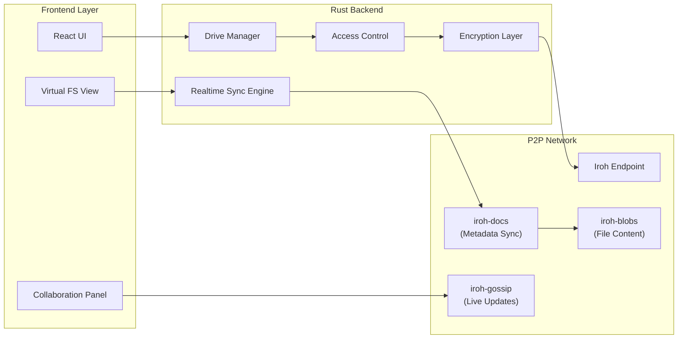
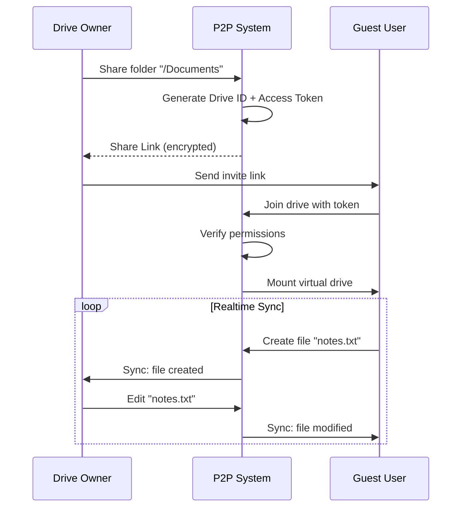
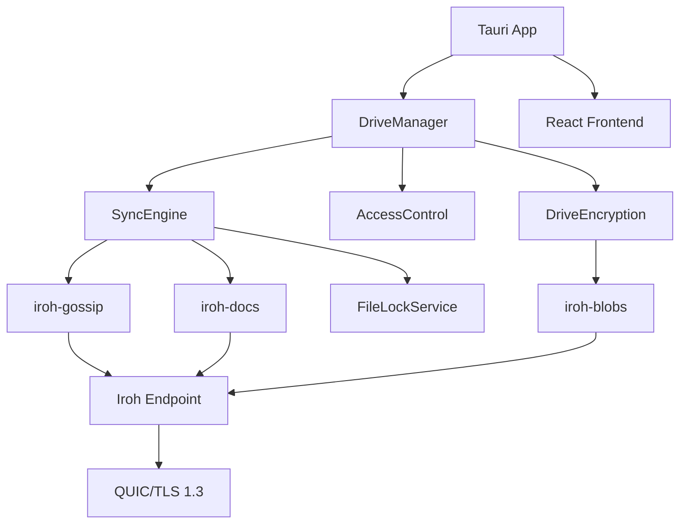

# System Architecture

## Core Architecture Overview



---

## Core Data Models

### Shared Drive

A shared drive represents a folder that can be accessed by multiple peers.

```rust
/// A shared drive represents a folder that can be accessed by multiple peers
#[derive(Clone, Serialize, Deserialize)]
pub struct SharedDrive {
    /// Unique identifier for this drive
    pub id: DriveId,
    /// Human-readable name
    pub name: String,
    /// Local path on owner's machine
    pub local_path: PathBuf,
    /// Owner's public key
    pub owner: NodeId,
    /// Access control list
    pub acl: AccessControlList,
    /// Encryption key (encrypted with each user's public key)
    pub encrypted_key: HashMap<NodeId, EncryptedKey>,
    /// Drive metadata document (iroh-docs)
    pub doc_id: DocId,
    /// Created timestamp
    pub created_at: DateTime<Utc>,
}

/// Unique drive identifier (derived from owner + path + timestamp)
#[derive(Clone, Copy, Hash, Eq, PartialEq, Serialize, Deserialize)]
pub struct DriveId([u8; 32]);

impl DriveId {
    pub fn generate(owner: &NodeId, path: &Path) -> Self {
        let mut hasher = blake3::Hasher::new();
        hasher.update(owner.as_bytes());
        hasher.update(path.to_string_lossy().as_bytes());
        hasher.update(&Utc::now().timestamp().to_le_bytes());
        Self(hasher.finalize().into())
    }
}
```

---

## Core Features

### Feature 1: Realtime Shared Drive

A folder shared by one user that others can access as if it were a local drive.



### Feature 2: Fine-Grained Access Control

```rust
/// Permission levels for drive access
#[derive(Clone, Copy, PartialEq, Eq, PartialOrd, Ord, Serialize, Deserialize)]
pub enum Permission {
    /// Can view and download files
    Read = 1,
    /// Can view, download, and upload files
    Write = 2,
    /// Can view, download, upload, and delete files
    Manage = 3,
    /// Full control including sharing and permission changes
    Admin = 4,
}

/// Access control list for a drive
#[derive(Clone, Serialize, Deserialize)]
pub struct AccessControlList {
    /// Per-user permissions
    pub users: HashMap<NodeId, UserAccess>,
    /// Default permission for invited users (None = explicit invite required)
    pub default_permission: Option<Permission>,
    /// Path-specific overrides (e.g., "/private" -> Read only)
    pub path_rules: Vec<PathRule>,
}

#[derive(Clone, Serialize, Deserialize)]
pub struct UserAccess {
    pub node_id: NodeId,
    pub permission: Permission,
    pub granted_by: NodeId,
    pub granted_at: DateTime<Utc>,
    pub expires_at: Option<DateTime<Utc>>,
    /// Optional: restrict to specific paths
    pub allowed_paths: Option<Vec<PathBuf>>,
}

#[derive(Clone, Serialize, Deserialize)]
pub struct PathRule {
    /// Glob pattern (e.g., "/sensitive/**")
    pub pattern: String,
    /// Minimum permission required to access
    pub min_permission: Permission,
    /// Users exempted from this rule
    pub exemptions: HashSet<NodeId>,
}
```

### Feature 3: Realtime Synchronization

Live updates using iroh-gossip for events and iroh-docs for metadata.

```rust
/// Events broadcast over gossip for realtime updates
#[derive(Clone, Serialize, Deserialize)]
pub enum DriveEvent {
    /// A file was created or modified
    FileChanged {
        path: PathBuf,
        hash: Hash,
        size: u64,
        modified_by: NodeId,
        timestamp: DateTime<Utc>,
    },
    /// A file was deleted
    FileDeleted {
        path: PathBuf,
        deleted_by: NodeId,
        timestamp: DateTime<Utc>,
    },
    /// A file is being edited (for conflict avoidance)
    FileEditStarted {
        path: PathBuf,
        editor: NodeId,
    },
    /// A file edit session ended
    FileEditEnded {
        path: PathBuf,
        editor: NodeId,
    },
    /// User joined the drive
    UserJoined {
        user: NodeId,
        permission: Permission,
    },
    /// User left the drive
    UserLeft {
        user: NodeId,
    },
    /// Permissions changed
    PermissionChanged {
        user: NodeId,
        old: Option<Permission>,
        new: Option<Permission>,
        changed_by: NodeId,
    },
}

/// Realtime sync engine
pub struct SyncEngine {
    gossip: Gossip,
    doc: Doc,
    drive_id: DriveId,
    local_path: PathBuf,
    event_tx: broadcast::Sender<DriveEvent>,
}
```

### Feature 4: File Locking & Conflict Resolution

```rust
/// Distributed file locking service
pub struct FileLockService {
    locks: RwLock<HashMap<PathBuf, FileLock>>,
    gossip: Gossip,
}

#[derive(Clone, Serialize, Deserialize)]
pub struct FileLock {
    pub path: PathBuf,
    pub holder: NodeId,
    pub acquired_at: DateTime<Utc>,
    pub lock_type: LockType,
}

#[derive(Clone, Copy, Serialize, Deserialize)]
pub enum LockType {
    /// Soft lock - warns others but doesn't block
    Advisory,
    /// Hard lock - blocks other writes
    Exclusive,
}

#[derive(Clone, Serialize, Deserialize)]
pub struct ConflictInfo {
    pub path: PathBuf,
    pub local_version: FileVersion,
    pub remote_version: FileVersion,
    pub conflict_type: ConflictType,
}

#[derive(Clone, Serialize, Deserialize)]
pub enum ConflictType {
    /// Both modified the same file
    BothModified,
    /// One modified, one deleted
    ModifyDelete { modified_by: NodeId, deleted_by: NodeId },
    /// Parent directory conflict
    DirectoryConflict,
}

#[derive(Clone, Serialize, Deserialize)]
pub enum ConflictResolution {
    /// Keep local version
    KeepLocal,
    /// Keep remote version
    KeepRemote,
    /// Keep both with renamed copy
    KeepBoth { local_suffix: String, remote_suffix: String },
    /// Merge (for compatible file types)
    Merge,
    /// Manual resolution later
    Defer,
}
```

---

## Component Dependencies


