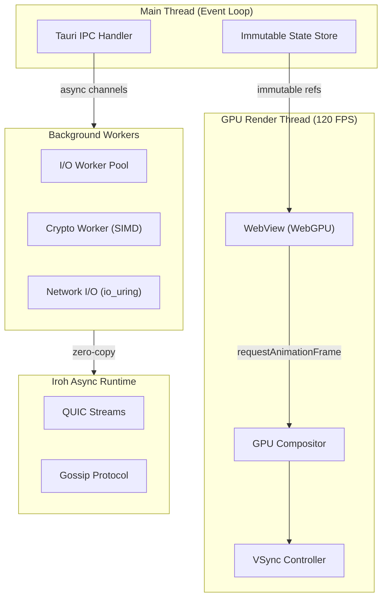

# Performance Architecture

> [!IMPORTANT]
> This system is designed for **120 FPS UI responsiveness** and **sub-10ms network latency** for realtime collaboration.

## Performance Targets

| Metric | Target | Strategy |
|--------|--------|----------|
| **UI Frame Rate** | 120 FPS (8.33ms/frame) | GPU-accelerated rendering, zero main-thread blocking |
| **Input Latency** | < 16ms | Dedicated input processing thread |
| **Network RTT** | < 10ms (LAN) / < 50ms (WAN) | QUIC 0-RTT, connection pooling |
| **File Sync Latency** | < 100ms | Delta sync, streaming updates |
| **Memory Pressure** | < 200MB base | Zero-copy buffers, memory pooling |

---

## Architecture for 120 FPS



---

## Zero-Copy Data Pipeline

```rust
use bytes::Bytes;
use crossbeam_channel::{bounded, Sender, Receiver};

/// Zero-copy buffer pool for file transfers
pub struct BufferPool {
    /// Pre-allocated buffers (avoid malloc in hot path)
    pool: crossbeam_queue::ArrayQueue<BytesMut>,
    buffer_size: usize,
}

impl BufferPool {
    pub fn new(capacity: usize, buffer_size: usize) -> Self {
        let pool = crossbeam_queue::ArrayQueue::new(capacity);
        for _ in 0..capacity {
            let _ = pool.push(BytesMut::with_capacity(buffer_size));
        }
        Self { pool, buffer_size }
    }
    
    /// Get a buffer (zero allocation in hot path)
    #[inline]
    pub fn get(&self) -> BytesMut {
        self.pool.pop().unwrap_or_else(|| BytesMut::with_capacity(self.buffer_size))
    }
    
    /// Return buffer to pool
    #[inline]
    pub fn put(&self, mut buf: BytesMut) {
        buf.clear();
        let _ = self.pool.push(buf);
    }
}

/// File chunk for streaming (zero-copy)
pub struct FileChunk {
    /// Immutable reference-counted bytes (no copy on clone)
    pub data: Bytes,
    pub offset: u64,
    pub hash: [u8; 32],
}
```

---

## Frontend Performance (React + WebGPU)

```typescript
// Use React 18 concurrent features for 120 FPS
import { useDeferredValue, useTransition, memo } from 'react';

// Virtualized file list - only render visible items
const FileList = memo(({ files, containerHeight }) => {
  const [startIndex, endIndex] = useVirtualScroll(files.length, 48, containerHeight);
  
  // Defer heavy updates to not block rendering
  const deferredFiles = useDeferredValue(files.slice(startIndex, endIndex));
  
  return (
    <div style={{ height: containerHeight, overflow: 'auto' }}>
      <div style={{ height: startIndex * 48 }} /> {/* Spacer */}
      {deferredFiles.map(file => (
        <FileRow key={file.id} file={file} />
      ))}
      <div style={{ height: (files.length - endIndex) * 48 }} />
    </div>
  );
});

// Offload heavy work to Web Workers
const cryptoWorker = new Worker(new URL('./crypto.worker.ts', import.meta.url));

// Use requestIdleCallback for non-urgent work
function scheduleBackgroundTask(task: () => void) {
  if ('requestIdleCallback' in window) {
    requestIdleCallback(task, { timeout: 50 });
  } else {
    setTimeout(task, 0);
  }
}
```

---

## GPU-Accelerated UI with CSS

```css
/* Force GPU compositing for smooth animations */
.file-list-container {
  transform: translateZ(0); /* Force GPU layer */
  will-change: transform, scroll-position;
  contain: layout style paint; /* CSS containment */
}

.file-row {
  contain: layout style; /* Isolate reflows */
  content-visibility: auto; /* Skip offscreen rendering */
  contain-intrinsic-size: 48px; /* Reserve space */
}

/* Use CSS transforms instead of layout properties */
.slide-animation {
  transform: translateX(var(--slide-offset));
  transition: transform 0.15s cubic-bezier(0.4, 0, 0.2, 1);
}

/* Reduce paint complexity */
.transfer-progress {
  /* Use opacity and transform only - GPU composited */
  opacity: var(--progress);
  transform: scaleX(var(--progress));
}
```

---

## Low-Latency Networking

```rust
use iroh::Endpoint;
use quinn::{RecvStream, SendStream};

/// Optimized network configuration for low latency
pub fn create_low_latency_endpoint() -> iroh::endpoint::Builder {
    Endpoint::builder()
        // Enable 0-RTT for instant reconnection
        .transport_config(Arc::new({
            let mut cfg = quinn::TransportConfig::default();
            
            // Aggressive keep-alive for NAT
            cfg.keep_alive_interval(Some(Duration::from_secs(5)));
            
            // Low initial RTT estimate
            cfg.initial_rtt(Duration::from_millis(10));
            
            // Faster loss detection
            cfg.time_threshold(1.125); // More aggressive than default 9/8
            
            // Larger initial window for faster ramp-up
            cfg.initial_window(14720 * 4);
            
            // Enable ECN for congestion signaling
            cfg.allow_ecn(true);
            
            // Reduce max idle timeout
            cfg.max_idle_timeout(Some(Duration::from_secs(30).try_into().unwrap()));
            
            cfg
        }))
        // Use n0's optimized relay network
        .discovery_n0()
}

/// Message priority for latency-sensitive operations
#[derive(Clone, Copy, PartialEq, Eq, PartialOrd, Ord)]
pub enum Priority {
    /// User input, cursor movement (< 16ms)
    Realtime = 0,
    /// File change notifications (< 50ms)
    Interactive = 1,
    /// File content transfer (best effort)
    Bulk = 2,
}

/// Priority-based message queue
pub struct PriorityQueue {
    realtime: crossbeam_channel::Sender<Message>,
    interactive: crossbeam_channel::Sender<Message>,
    bulk: crossbeam_channel::Sender<Message>,
}
```

---

## Delta Sync for Instant Updates

```rust
use similar::{ChangeTag, TextDiff};

/// Delta-based file synchronization for minimal latency
pub struct DeltaSync {
    /// Rolling hash window for fast chunk matching
    chunk_cache: HashMap<u64, ChunkInfo>,
}

impl DeltaSync {
    /// Compute minimal delta between versions
    pub fn compute_delta(&self, old: &[u8], new: &[u8]) -> Delta {
        // For small files (< 1MB), use text diff
        if new.len() < 1_000_000 {
            return self.text_delta(old, new);
        }
        
        // For large files, use rsync rolling checksum
        self.rolling_delta(old, new)
    }
    
    /// Apply delta to reconstruct file (zero-copy when possible)
    pub fn apply_delta(&self, base: &[u8], delta: &Delta) -> Bytes {
        let mut result = BytesMut::with_capacity(delta.result_size);
        
        for op in &delta.ops {
            match op {
                DeltaOp::Copy { start, len } => {
                    result.extend_from_slice(&base[*start..*start + *len]);
                }
                DeltaOp::Insert { data } => {
                    result.extend_from_slice(data);
                }
            }
        }
        
        result.freeze()
    }
}

#[derive(Serialize, Deserialize)]
pub struct Delta {
    pub base_hash: [u8; 32],
    pub result_hash: [u8; 32],
    pub result_size: usize,
    pub ops: Vec<DeltaOp>,
}

#[derive(Serialize, Deserialize)]
pub enum DeltaOp {
    /// Copy bytes from base file
    Copy { start: usize, len: usize },
    /// Insert new bytes
    Insert { data: Vec<u8> },
}
```

---

## Performance Monitoring

```rust
use metrics::{gauge, histogram, counter};

/// Real-time performance metrics
pub struct PerfMonitor {
    frame_times: histogram::Histogram,
    network_rtt: gauge::Gauge,
    sync_latency: histogram::Histogram,
}

impl PerfMonitor {
    /// Track frame rendering time
    pub fn record_frame(&self, duration: Duration) {
        histogram!("ui.frame_time_ms", duration.as_secs_f64() * 1000.0);
        
        // Alert if dropping below 120 FPS
        if duration > Duration::from_micros(8333) {
            counter!("ui.frame_drops", 1);
        }
    }
    
    /// Track network round-trip time
    pub fn record_rtt(&self, rtt: Duration) {
        gauge!("network.rtt_ms", rtt.as_secs_f64() * 1000.0);
    }
    
    /// Track file sync latency
    pub fn record_sync(&self, latency: Duration) {
        histogram!("sync.latency_ms", latency.as_secs_f64() * 1000.0);
    }
}

// Expose metrics to frontend
#[tauri::command]
async fn get_performance_stats() -> PerformanceStats {
    PerformanceStats {
        avg_frame_time_ms: metrics::get_avg("ui.frame_time_ms"),
        frame_drops_last_minute: metrics::get_count("ui.frame_drops"),
        network_rtt_ms: metrics::get_gauge("network.rtt_ms"),
        avg_sync_latency_ms: metrics::get_avg("sync.latency_ms"),
    }
}
```

---

## Latency Budget

```
┌─────────────────────────────────────────────────────────────────┐
│                    FRAME BUDGET: 8.33ms (120 FPS)               │
├─────────────────────────────────────────────────────────────────┤
│  Input Processing    │███░░░░░░░░░░░░░░░░░│  1ms               │
│  State Update        │████░░░░░░░░░░░░░░░░│  1.5ms             │
│  React Reconcile     │██████░░░░░░░░░░░░░░│  2ms               │
│  Layout/Paint        │████░░░░░░░░░░░░░░░░│  1.5ms             │
│  GPU Composite       │█████░░░░░░░░░░░░░░░│  2ms               │
│  Buffer (headroom)   │░░░░░░░░░░░░░░░░░░░░│  0.33ms            │
└─────────────────────────────────────────────────────────────────┘

┌─────────────────────────────────────────────────────────────────┐
│                NETWORK LATENCY BUDGET: < 10ms (LAN)             │
├─────────────────────────────────────────────────────────────────┤
│  QUIC Handshake      │ 0-RTT (cached) or 1-RTT                 │
│  Serialization       │███░░░░░░░░░░░░░░░░░│  < 0.5ms           │
│  Encryption          │███░░░░░░░░░░░░░░░░░│  < 0.5ms (SIMD)    │
│  Network Transit     │████████████░░░░░░░░│  < 5ms             │
│  Deserialization     │███░░░░░░░░░░░░░░░░░│  < 0.5ms           │
│  Event Dispatch      │███░░░░░░░░░░░░░░░░░│  < 0.5ms           │
└─────────────────────────────────────────────────────────────────┘
```

---

## Async Runtime Optimization

```rust
use tokio::runtime::Builder;

/// Create optimized Tokio runtime for the app
pub fn create_optimized_runtime() -> tokio::runtime::Runtime {
    Builder::new_multi_thread()
        // Dedicated threads for network I/O
        .worker_threads(4)
        // Separate blocking pool for file I/O
        .max_blocking_threads(8)
        // Reduce scheduler overhead
        .event_interval(61) // Prime number reduces lock contention
        // Enable io_uring on Linux for zero-copy I/O
        .enable_all()
        .build()
        .expect("Failed to create runtime")
}

/// Use dedicated thread for latency-critical gossip
pub fn spawn_gossip_handler(gossip: Gossip) -> JoinHandle<()> {
    std::thread::Builder::new()
        .name("gossip-realtime".into())
        .spawn(move || {
            // Pin to CPU core for cache locality
            #[cfg(target_os = "linux")]
            {
                use core_affinity::CoreId;
                if let Some(core) = core_affinity::get_core_ids().and_then(|c| c.first().cloned()) {
                    core_affinity::set_for_current(core);
                }
            }
            
            // High-precision event loop
            let rt = tokio::runtime::Builder::new_current_thread()
                .enable_all()
                .build()
                .unwrap();
            
            rt.block_on(async move {
                gossip.run_realtime_loop().await;
            });
        })
        .expect("Failed to spawn gossip thread")
}
```
