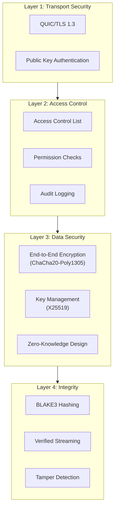
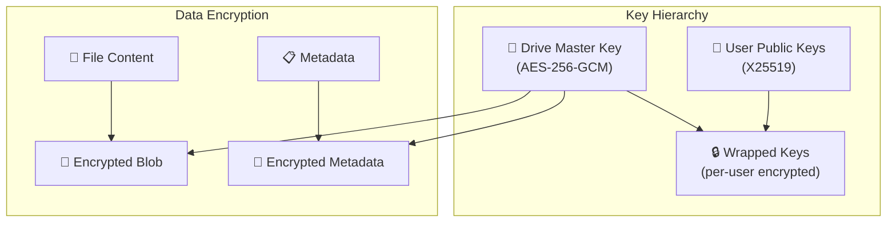
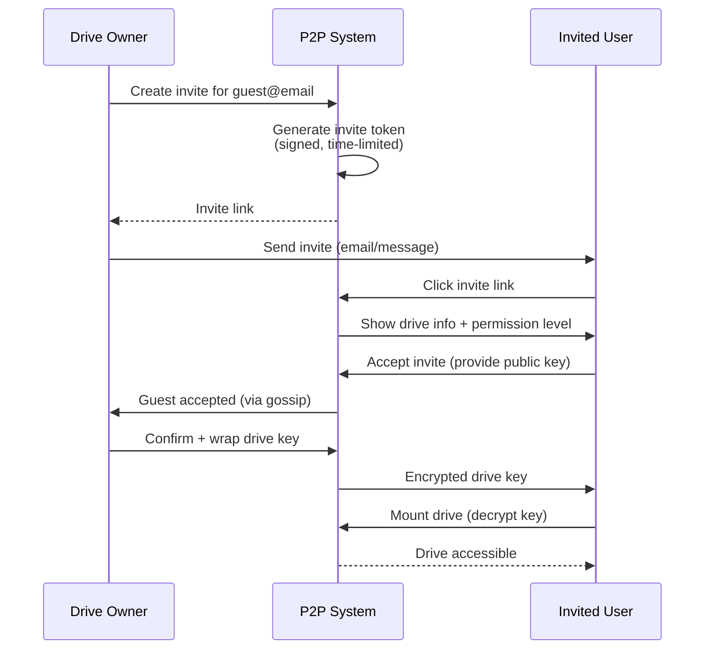

# Security Model

> [!NOTE]
> **Security Audit Status (December 2024)**
> 
> | Feature | Status |
> |---------|--------|
> | ACL Permission Checks | ✅ Implemented |
> | Gossip Message Authentication | ✅ Implemented |
> | E2E Encryption Integration | ✅ Implemented |
> | Key Rotation on Revocation | ⏳ Planned |
> | Token Revocation List | ⏳ Planned |

## Security Layers



---

## Security Features Summary

| Feature | Implementation | Status |
|---------|---------------|--------|
| **Transport Encryption** | QUIC/TLS 1.3 | ✅ Iroh default |
| **Identity Verification** | Ed25519 signatures | ✅ Implemented |
| **E2E Encryption** | ChaCha20-Poly1305 | ✅ Implemented |
| **Key Distribution** | X25519 key exchange | ✅ Implemented |
| **Permission Enforcement** | Local ACL checks | ✅ Implemented |
| **Gossip Authentication** | Signed messages | ✅ Implemented |
| **Data Integrity** | BLAKE3 verified streaming | ✅ Implemented |
| **Key Rotation** | On user revocation | ⏳ Planned |
| **Token Revocation** | Explicit revocation list | ⏳ Planned |

---

## Implementation Details

### ACL Enforcement (Implemented)

All file operation commands now enforce ACL permission checks:

```rust
// Example from commands/files.rs
let acl = security.get_or_create_acl(&drive_id, &owner_hex).await;
if !acl.check_permission(&caller_hex, &path, Permission::Read) {
    return Err(AppError::AccessDenied {
        reason: "insufficient permission".to_string(),
    }.to_string());
}
```

**Protected Commands:**
- `list_files` - requires Read permission
- `read_file` / `read_file_encrypted` - requires Read permission
- `write_file` / `write_file_encrypted` - requires Write permission
- `delete_path` - requires Write permission
- `rename_path` - requires Write permission on both paths

### Gossip Message Authentication (Implemented)

All gossip messages are wrapped in a signed envelope:

```rust
// From core/events.rs
pub struct SignedGossipMessage {
    pub event: DriveEvent,      // The actual event
    pub sender: NodeId,         // Sender's public key
    pub timestamp_ms: i64,      // Unix timestamp (ms)
    pub signature: Vec<u8>,     // Ed25519 signature
}
```

**Protection Against:**
- Message forgery (invalid signatures rejected)
- Replay attacks (messages > 5 minutes old rejected)
- Sender impersonation (signature tied to sender's key)

### E2E Encryption (Implemented)

Files can be encrypted at rest using the `EncryptionManager`:

```rust
// From crypto/encryption_manager.rs
pub struct EncryptionManager {
    exchange_keypair: KeyExchangePair,  // For receiving wrapped keys
    cached_keys: RwLock<HashMap<String, DriveKey>>,
    db: Arc<Database>,
}
```

**Features:**
- Per-drive master keys (256-bit)
- Per-file key derivation via BLAKE3 KDF
- ChaCha20-Poly1305 authenticated encryption
- X25519 key wrapping for key sharing

**New Tauri Commands:**
- `read_file_encrypted` - Read and decrypt file
- `write_file_encrypted` - Encrypt and write file

---

## End-to-End Encryption

Zero-knowledge architecture where the drive owner controls all encryption keys.



### Encryption Implementation

```rust
use chacha20poly1305::{ChaCha20Poly1305, Key, Nonce, aead::Aead};
use x25519_dalek::{PublicKey, StaticSecret, SharedSecret};

/// Encryption service for drive content
pub struct DriveEncryption {
    /// Master key for this drive (only decrypted by authorized users)
    master_key: Key,
    /// Our secret key for key exchange
    secret_key: StaticSecret,
}

impl DriveEncryption {
    /// Create a new drive with fresh encryption keys
    pub fn new() -> Self {
        let mut rng = rand::thread_rng();
        let master_key = ChaCha20Poly1305::generate_key(&mut rng);
        let secret_key = StaticSecret::random_from_rng(&mut rng);
        
        Self { master_key, secret_key }
    }
    
    /// Wrap the master key for a specific user
    pub fn wrap_key_for_user(&self, user_public_key: &PublicKey) -> EncryptedKey {
        // Derive shared secret using X25519
        let shared = self.secret_key.diffie_hellman(user_public_key);
        
        // Use shared secret to encrypt master key
        let cipher = ChaCha20Poly1305::new(&derive_key(shared.as_bytes()));
        let nonce = Nonce::from_slice(&random_bytes::<12>());
        
        let encrypted = cipher.encrypt(nonce, self.master_key.as_slice()).unwrap();
        
        EncryptedKey {
            ephemeral_public: PublicKey::from(&self.secret_key),
            nonce: *nonce,
            ciphertext: encrypted,
        }
    }
    
    /// Encrypt file content
    pub fn encrypt_file(&self, plaintext: &[u8]) -> EncryptedBlob {
        let cipher = ChaCha20Poly1305::new(&self.master_key);
        let nonce = Nonce::from_slice(&random_bytes::<12>());
        let ciphertext = cipher.encrypt(nonce, plaintext).unwrap();
        
        EncryptedBlob { nonce: *nonce, ciphertext }
    }
    
    /// Decrypt file content
    pub fn decrypt_file(&self, blob: &EncryptedBlob) -> Result<Vec<u8>, CryptoError> {
        let cipher = ChaCha20Poly1305::new(&self.master_key);
        cipher.decrypt(&blob.nonce.into(), blob.ciphertext.as_slice())
            .map_err(|_| CryptoError::DecryptionFailed)
    }
}

#[derive(Serialize, Deserialize)]
pub struct EncryptedKey {
    pub ephemeral_public: PublicKey,
    pub nonce: [u8; 12],
    pub ciphertext: Vec<u8>,
}

#[derive(Serialize, Deserialize)]
pub struct EncryptedBlob {
    pub nonce: [u8; 12],
    pub ciphertext: Vec<u8>,
}
```

---

## Access Control Enforcement

```rust
impl AccessControlList {
    /// Check if a user can perform an operation on a path
    pub fn can_access(&self, user: &NodeId, path: &Path, required: Permission) -> bool {
        // Owner always has full access
        if self.is_owner(user) {
            return true;
        }
        
        // Check user-specific permission
        let user_perm = match self.users.get(user) {
            Some(access) => {
                // Check expiration
                if let Some(expires) = access.expires_at {
                    if Utc::now() > expires {
                        return false;
                    }
                }
                // Check path restriction
                if let Some(allowed) = &access.allowed_paths {
                    if !allowed.iter().any(|p| path.starts_with(p)) {
                        return false;
                    }
                }
                access.permission
            }
            None => match self.default_permission {
                Some(p) => p,
                None => return false,
            },
        };
        
        // Check path-specific rules
        for rule in &self.path_rules {
            if glob_match(&rule.pattern, path) && !rule.exemptions.contains(user) {
                if user_perm < rule.min_permission {
                    return false;
                }
            }
        }
        
        user_perm >= required
    }
}
```

---

## Secure Invite Flow



### Invite Token Structure

```rust
#[derive(Serialize, Deserialize)]
pub struct InviteToken {
    /// Drive being shared
    pub drive_id: DriveId,
    /// Permission level granted
    pub permission: Permission,
    /// Optional: specific email/identifier
    pub invitee_hint: Option<String>,
    /// Expiration time
    pub expires_at: DateTime<Utc>,
    /// Max uses (None = unlimited)
    pub max_uses: Option<u32>,
    /// Current use count
    pub use_count: u32,
    /// Owner's signature
    pub signature: Signature,
}

impl InviteToken {
    pub fn to_link(&self) -> String {
        let encoded = base64::encode_config(
            serde_json::to_vec(self).unwrap(),
            base64::URL_SAFE_NO_PAD
        );
        format!("p2pshare://invite/{}", encoded)
    }
    
    pub fn verify(&self, owner_public_key: &PublicKey) -> bool {
        // Verify signature
        let payload = self.signable_bytes();
        owner_public_key.verify(&payload, &self.signature).is_ok()
            && Utc::now() < self.expires_at
            && self.max_uses.map_or(true, |max| self.use_count < max)
    }
}
```

---

## Security Best Practices

> [!WARNING]
> **Key Security Considerations**

1. **Never store master keys in plaintext** - Always encrypted with user's key
2. **Rotate keys on user removal** - Revoked users should not retain access
3. **Validate all incoming events** - Check signatures and permissions
4. **Use constant-time comparisons** - Prevent timing attacks on auth
5. **Log security events** - Maintain audit trail for compliance
