# Security Model

## Security Layers


---

## Security Features Summary

| Feature | Implementation | Description |
|---------|---------------|-------------|
| **Transport Encryption** | QUIC/TLS 1.3 | All P2P traffic encrypted in transit |
| **Identity Verification** | Ed25519 signatures | Peers authenticated by public key |
| **E2E Encryption** | ChaCha20-Poly1305 | File content encrypted at rest |
| **Key Distribution** | X25519 key exchange | Per-user key wrapping |
| **Permission Enforcement** | Local ACL checks | Every operation verified |
| **Data Integrity** | BLAKE3 verified streaming | Tamper-proof transfers |
| **Audit Trail** | Signed operation log | All changes tracked |
| **Revocation** | Key rotation | Instant access removal |

---

## End-to-End Encryption

Zero-knowledge architecture where the drive owner controls all encryption keys.

```mermaid
graph TB
    subgraph KeyHierarchy["Key Hierarchy"]
        MasterKey["🔐 Drive Master Key<br/>(AES-256-GCM)"]
        UserKeys["👤 User Public Keys<br/>(X25519)"]
        WrappedKeys["🔒 Wrapped Keys<br/>(per-user encrypted)"]
    end
    
    subgraph Encryption["Data Encryption"]
        FileContent["📄 File Content"]
        EncryptedBlob["🔐 Encrypted Blob"]
        Metadata["📋 Metadata"]
        EncryptedMeta["🔐 Encrypted Metadata"]
    end
    
    MasterKey --> WrappedKeys
    UserKeys --> WrappedKeys
    MasterKey --> EncryptedBlob
    MasterKey --> EncryptedMeta
    FileContent --> EncryptedBlob
    Metadata --> EncryptedMeta
```



### Encryption Implementation

```rust
use chacha20poly1305::{ChaCha20Poly1305, Key, Nonce, aead::Aead};
use x25519_dalek::{PublicKey, StaticSecret, SharedSecret};

/// Encryption service for drive content
pub struct DriveEncryption {
    /// Master key for this drive (only decrypted by authorized users)
    master_key: Key,
    /// Our secret key for key exchange
    secret_key: StaticSecret,
}

impl DriveEncryption {
    /// Create a new drive with fresh encryption keys
    pub fn new() -> Self {
        let mut rng = rand::thread_rng();
        let master_key = ChaCha20Poly1305::generate_key(&mut rng);
        let secret_key = StaticSecret::random_from_rng(&mut rng);
        
        Self { master_key, secret_key }
    }
    
    /// Wrap the master key for a specific user
    pub fn wrap_key_for_user(&self, user_public_key: &PublicKey) -> EncryptedKey {
        // Derive shared secret using X25519
        let shared = self.secret_key.diffie_hellman(user_public_key);
        
        // Use shared secret to encrypt master key
        let cipher = ChaCha20Poly1305::new(&derive_key(shared.as_bytes()));
        let nonce = Nonce::from_slice(&random_bytes::<12>());
        
        let encrypted = cipher.encrypt(nonce, self.master_key.as_slice()).unwrap();
        
        EncryptedKey {
            ephemeral_public: PublicKey::from(&self.secret_key),
            nonce: *nonce,
            ciphertext: encrypted,
        }
    }
    
    /// Encrypt file content
    pub fn encrypt_file(&self, plaintext: &[u8]) -> EncryptedBlob {
        let cipher = ChaCha20Poly1305::new(&self.master_key);
        let nonce = Nonce::from_slice(&random_bytes::<12>());
        let ciphertext = cipher.encrypt(nonce, plaintext).unwrap();
        
        EncryptedBlob { nonce: *nonce, ciphertext }
    }
    
    /// Decrypt file content
    pub fn decrypt_file(&self, blob: &EncryptedBlob) -> Result<Vec<u8>, CryptoError> {
        let cipher = ChaCha20Poly1305::new(&self.master_key);
        cipher.decrypt(&blob.nonce.into(), blob.ciphertext.as_slice())
            .map_err(|_| CryptoError::DecryptionFailed)
    }
}

#[derive(Serialize, Deserialize)]
pub struct EncryptedKey {
    pub ephemeral_public: PublicKey,
    pub nonce: [u8; 12],
    pub ciphertext: Vec<u8>,
}

#[derive(Serialize, Deserialize)]
pub struct EncryptedBlob {
    pub nonce: [u8; 12],
    pub ciphertext: Vec<u8>,
}
```

---

## Access Control Enforcement

```rust
impl AccessControlList {
    /// Check if a user can perform an operation on a path
    pub fn can_access(&self, user: &NodeId, path: &Path, required: Permission) -> bool {
        // Owner always has full access
        if self.is_owner(user) {
            return true;
        }
        
        // Check user-specific permission
        let user_perm = match self.users.get(user) {
            Some(access) => {
                // Check expiration
                if let Some(expires) = access.expires_at {
                    if Utc::now() > expires {
                        return false;
                    }
                }
                // Check path restriction
                if let Some(allowed) = &access.allowed_paths {
                    if !allowed.iter().any(|p| path.starts_with(p)) {
                        return false;
                    }
                }
                access.permission
            }
            None => match self.default_permission {
                Some(p) => p,
                None => return false,
            },
        };
        
        // Check path-specific rules
        for rule in &self.path_rules {
            if glob_match(&rule.pattern, path) && !rule.exemptions.contains(user) {
                if user_perm < rule.min_permission {
                    return false;
                }
            }
        }
        
        user_perm >= required
    }
}
```

---

## Secure Invite Flow


### Invite Token Structure

```rust
#[derive(Serialize, Deserialize)]
pub struct InviteToken {
    /// Drive being shared
    pub drive_id: DriveId,
    /// Permission level granted
    pub permission: Permission,
    /// Optional: specific email/identifier
    pub invitee_hint: Option<String>,
    /// Expiration time
    pub expires_at: DateTime<Utc>,
    /// Max uses (None = unlimited)
    pub max_uses: Option<u32>,
    /// Current use count
    pub use_count: u32,
    /// Owner's signature
    pub signature: Signature,
}

impl InviteToken {
    pub fn to_link(&self) -> String {
        let encoded = base64::encode_config(
            serde_json::to_vec(self).unwrap(),
            base64::URL_SAFE_NO_PAD
        );
        format!("p2pshare://invite/{}", encoded)
    }
    
    pub fn verify(&self, owner_public_key: &PublicKey) -> bool {
        // Verify signature
        let payload = self.signable_bytes();
        owner_public_key.verify(&payload, &self.signature).is_ok()
            && Utc::now() < self.expires_at
            && self.max_uses.map_or(true, |max| self.use_count < max)
    }
}
```

---

## Security Best Practices

> [!WARNING]
> **Key Security Considerations**

1. **Never store master keys in plaintext** - Always encrypted with user's key
2. **Rotate keys on user removal** - Revoked users should not retain access
3. **Validate all incoming events** - Check signatures and permissions
4. **Use constant-time comparisons** - Prevent timing attacks on auth
5. **Log security events** - Maintain audit trail for compliance
